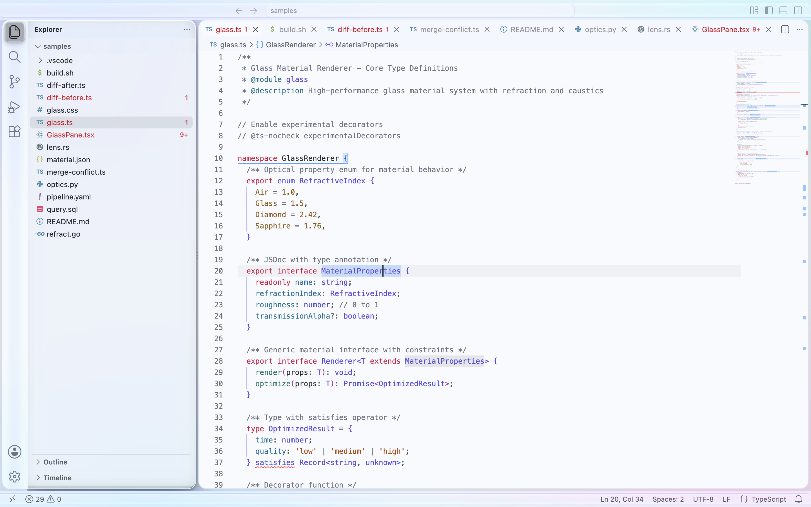
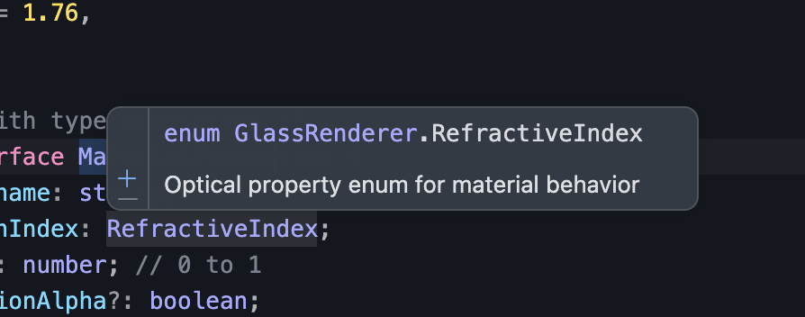
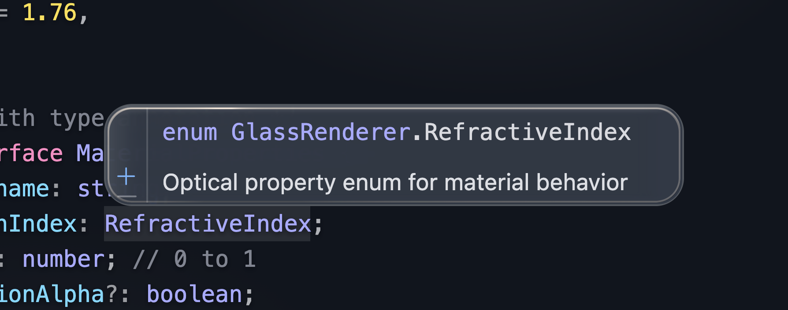
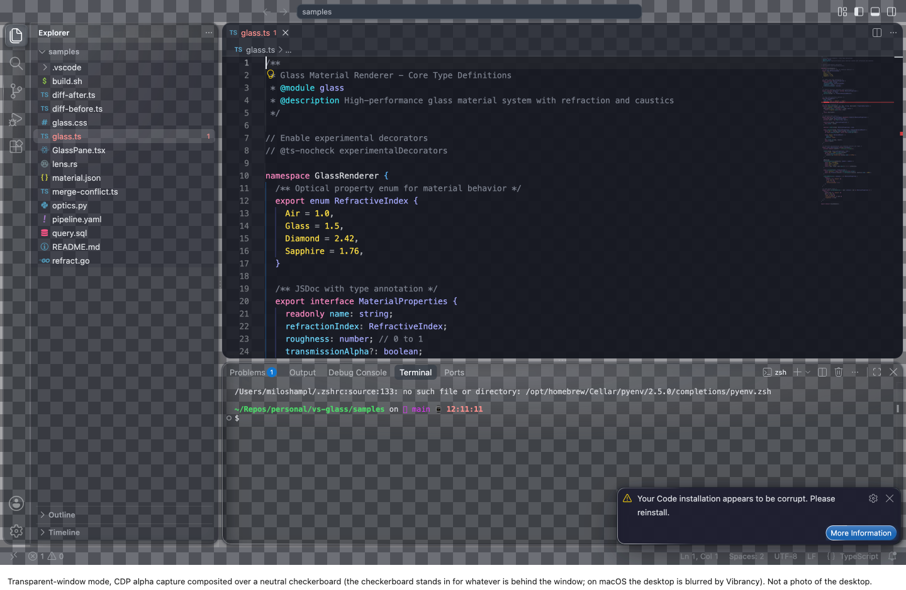

# VS Glass

Apple Liquid Glass for VS Code — refractive edges, specular highlights, and layered glass materials.

[](https://github.com/MilosHampl/vs-glass/releases/latest)
[](LICENSE)

[](https://github.com/MilosHampl/vs-glass/actions/workflows/ci.yml)

VS Glass is an unofficial, fan-made project. It is not affiliated with, endorsed by, or sponsored by Apple.

## Screenshots


### Variants

| | |
|---|---|
| **Glass Regular Dark**  | **Glass Regular Light**  |
| **Glass Clear**  | **Glass Opaque**  |

`Glass Opaque` has no Layer 2 effects, by design — see [Install](#install).

### Layer 1 alone vs. Layer 1 + 2

The command palette floating over code is where the refraction actually reads: a frosted body, a clear
refracted rim, and a chromatic edge where the backdrop bends.

| Layer 1 only | Layer 1 + 2 |
|---|---|
|  |  |
|  |  |

**What you're looking at:**

- A lensing rim on floating widgets — the backdrop is genuinely displaced, not just blurred.
- A specular ring along the top edge, brightest near a fixed virtual light source.
- Layered slab shadows that read as material thickness, not a flat drop shadow.
- Wallpaper colour bleeding through the glass and tinting each pane differently.
- Concentric corner radii — inner elements nest inside outer ones, radius shrinking with padding.

## Install

VS Glass ships in two layers. **Layer 1** is the color theme — install it the normal way, below. **Layer 2**
is the CSS that makes the theme's colors actually behave like glass (refraction, specular highlights,
motion) — it needs an extra step, covered in [Enable the glass effects](#enable-the-glass-effects-layer-2).
If you only install Layer 1, you get the right palette on flat rectangles; if you want it to look like
glass, do both.

### The theme (Layer 1)

**a. From Releases:**

```sh
# Download vs-glass-1.0.0.vsix from https://github.com/MilosHampl/vs-glass/releases/latest, then:
code --install-extension vs-glass-1.0.0.vsix
```

Or, in VS Code: Extensions view → `…` → **Install from VSIX…**.

**b. One-liner (needs the `gh` CLI):**

```sh
gh release download --repo MilosHampl/vs-glass --pattern '*.vsix' && code --install-extension vs-glass-*.vsix
```

**c. From source:**

```sh
git clone https://github.com/MilosHampl/vs-glass && cd vs-glass
npm ci && npm run build
npx @vscode/vsce package --no-dependencies
code --install-extension vs-glass-1.0.0.vsix
```

Then pick a theme (⌘K ⌘T / Ctrl K Ctrl T):

- **Glass Regular Dark** — the flagship variant.
- **Glass Regular Light**
- **Glass Clear** — more transparent, more luminous, with a dimming layer behind text-bearing surfaces to
  keep them legible.
- **Glass Opaque** — the Reduce Transparency equivalent: every alpha is 1, no Layer 2 effects. The right
  choice if you don't want Layer 2 at all — flat, distraction-free, good for screen-sharing or recording.

VS Glass is **not on the VS Code Marketplace**. That's deliberate for v1.0.0 — see `PROGRESS.md` for what
publishing would require.

### Enable the glass effects (Layer 2)

This is the reason the project exists. `glass/glass.css` is the injected CSS that produces the lensing at
widget edges, the specular highlight ring, the material-thickness shadows, and the liquid hover/press
motion. Without it, the theme's colors sit on flat rectangles — no bending, no shine, no depth.

VS Code has no supported extension point for injecting CSS, so every route below works by **patching a
file inside your VS Code installation**. All three trip VS Code's own file-integrity check, producing a
harmless **"Your Code installation appears to be corrupt"** notice the first time — click the notification's
gear icon and choose **Don't Show Again**, or install
[`RimuruChan.vscode-fix-checksums-next`](https://marketplace.visualstudio.com/items?itemName=RimuruChan.vscode-fix-checksums-next)
and run its Apply command. This is expected, not a sign anything is broken. Pick one route:

- **Route A — Custom CSS and JS Loader** (`be5invis.vscode-custom-css`). Install it, then add to
  `settings.json`:

  ```json
  "vscode_custom_css.imports": [
    "file:///ABSOLUTE/PATH/vs-glass/glass/glass.css"
  ]
  ```

  Run **Enable Custom CSS and JS**, then fully quit and reopen VS Code. Note the `file://` prefix — this
  extension wants a URL, not a plain path. Best if you're editing `glass.css` yourself: re-run
  **Reload Custom CSS and JS** after each edit for a fast loop.

- **Route B — `scripts/inject.sh`** (this repo's own installer, no extension needed):

  ```sh
  bash scripts/inject.sh install               # wallpaper mode
  bash scripts/inject.sh install --transparent  # transparent-window mode, pairs with Route C
  ```

  Then quit VS Code fully (⌘Q) and reopen. It appends `glass.css` straight into VS Code's own
  `workbench.desktop.main.css` and fixes the `product.json` checksum for you, so — unlike Routes A and C —
  it needs **no CSP change at all**, and the corrupt-installation notice shouldn't appear with this route.
  `bash scripts/inject.sh status` reports drift after a VS Code update; `bash scripts/inject.sh uninstall`
  restores both files byte-exact from its own backup.

- **Route C — Vibrancy Continued** (`illixion.vscode-vibrancy-continued`), for a genuinely see-through
  window using native OS blur:

  ```json
  {
    "vscode_vibrancy.theme": "Custom theme (use imports)",
    "vscode_vibrancy.imports": [
      "/ABSOLUTE/PATH/vs-glass/glass/glass.css",
      "/ABSOLUTE/PATH/vs-glass/glass/glass-transparent.css"
    ],
    "vscode_vibrancy.type": "under-window"
  }
  ```



  `vscode_vibrancy.imports` takes plain file paths, not `file://` URLs — the opposite of Route A, and the
  most common mistake. Load `glass-transparent.css` **second**, after `glass.css`. Run **Reload Vibrancy**,
  then fully restart VS Code — Vibrancy patches the Electron main process, which is only read at launch.

**Updating after a VS Code upgrade:** VS Code's updater overwrites every file these routes patch, so all
three need to be re-applied after each update — this is ongoing maintenance, not one-time setup. Route A:
re-run **Enable Custom CSS and JS**. Route B: re-run `bash scripts/inject.sh install` (check
`bash scripts/inject.sh status` first to see the drift). Route C: re-run **Reload Vibrancy**, then restart.

**Full uninstall:** Route A — **Disable Custom CSS and JS**, then remove `vscode_custom_css.imports`. Route
B — `bash scripts/inject.sh uninstall`. Route C — **Disable Vibrancy**, then remove the
`vscode_vibrancy.*` settings. To remove the theme itself: `code --uninstall-extension MilosHampl.vs-glass`.

> **Risks**
> - Every route patches files inside your VS Code installation, not a supported extension point.
> - Route A removes the workbench's entire Content-Security-Policy meta tag for the lifetime of the
>   window — a real, if narrow, reduction in defense-in-depth while it's active.
> - The patch must be re-applied after every VS Code update, or it silently disappears.
> - Microsoft can change `workbench.experimental.modernUI` (rename, restrict, or remove it) in a future
>   release without notice; Layer 2's floating-panes optics depend on it and degrade to shadow-only without
>   it.

**Just want it off, right now, without touching settings?** Open DevTools (Help → Toggle Developer Tools)
and run `document.querySelector('.monaco-workbench').classList.add('vs-glass-off')` in the console. It's a
live, in-session toggle, lost on reload — useful for isolating whether Layer 2 is responsible for something
you're seeing. Switching to a different theme (including `Glass Opaque`) is the persistent equivalent.

Full walkthrough and troubleshooting: [`glass/install.md`](glass/install.md).

Layer 2 is built around VS Code's floating-card layout. Set `"workbench.experimental.modernUI": true` —
the intended layout, and the substrate for the floating-panes and concentric-geometry optics below.

## Recommended companion settings

```json
{
  "workbench.experimental.modernUI": true,
  "window.titleBarStyle": "custom",
  "editor.fontFamily": "'SF Mono', 'JetBrains Mono', Menlo, monospace",
  "editor.fontLigatures": true,
  "editor.cursorSmoothCaretAnimation": "on",
  "editor.smoothScrolling": true,
  "workbench.list.smoothScrolling": true,
  "editor.minimap.renderCharacters": false,
  "editor.bracketPairColorization.enabled": true,
  "editor.guides.bracketPairs": "active"
}
```

`SF Mono` is Apple's system monospace font — it is **not bundled** with VS Glass or VS Code, only
available if you already have it installed (e.g. via Xcode). `JetBrains Mono` is the first cross-platform
fallback. If you're on the Vibrancy Continued route (Route C above), also set
`"terminal.integrated.gpuAcceleration": "off"` — without it the terminal's GPU renderer can paint over the
vibrancy material incorrectly.

## How close is this to real Liquid Glass?

An honest scorecard against Apple's own description of each optic (WWDC25 sessions 219/323/356, HIG
Materials). Layer 1 = the color theme; Layer 2 = the injected CSS.

| # | Optic | Status | Layer | Notes |
|---|---|---|---|---|
| 1 | Lensing / refraction | Reproduced | 2 | SVG `feDisplacementMap` in `backdrop-filter`: frosted body, clear rim, chromatic aberration. Sidebars refract the wallpaper; overlays refract the code beneath them. |
| 2 | Specular edge highlight | Reproduced | 2 | A `conic-gradient` ring from a fixed virtual light. Static — Apple's moves with device motion; ours moves only on hover/focus. |
| 3 | Material thickness | Reproduced | 2 | Layered inset/outer shadows simulate a slab. Not content-aware the way Apple's is (shadow opacity doesn't change based on what's directly behind it). |
| 4 | Vibrancy | Approximated | 1 + 2 | Four alpha label tiers plus `saturate()` and `mix-blend-mode: plus-lighter` on chrome text. No true per-pixel colour sampling of what's behind each glyph. |
| 5 | Floating layered panes | Reproduced | 1 + 2 | VS Code's modern floating layout plus Layer 2's elevation shadows. Degrades to flush seams without `workbench.experimental.modernUI`. |
| 6 | Concentric geometry | Reproduced | 2 | Radius tokens overridden so inner radius = parent radius − padding. VS Code's own radii still drive most controls outside Layer 2's reach. |
| 7 | Adaptive tint | Approximated | 1 + 2 | A wallpaper mesh in palette hues sits under low-alpha glass. Layer 1 alone is a fixed cool tint, not adaptive. In transparent-window mode, the OS blur of your actual desktop supplies real adaptive tint instead. |
| 8 | Liquid response | Approximated | 2 | CSS transitions, ~120–240 ms with a damped ease. No spring physics, no morphing between shapes — Apple's motion model is elastic and undocumented numerically. |

Performance: on a 120 Hz display, editor scrolling measures p50 8.3 ms / p95 10.2 ms with every glass surface
active versus p50 8.3 ms / p95 9.8 ms with effects off. The heaviest case, scrolling code beneath an open
command palette, holds p95 at 16.7 ms (60 fps). Method and full table in `DESIGN.md` §6.

**What is not possible:** refracting the desktop behind a transparent window — CSS `backdrop-filter` can
only bend what the page itself has painted, never another window or the desktop. True content-aware
shadows (opacity driven by what's directly behind an element). Device-motion-driven highlights. Editor text
is never filtered, by design — legibility comes first.

## Contributing

See [`CONTRIBUTING.md`](CONTRIBUTING.md) — this is a generated theme; almost nothing under `themes/` or
`glass/` should be hand-edited. It covers the build pipeline, the material model, audit gates, and the
release process. Please also read the [Code of Conduct](CODE_OF_CONDUCT.md).

## License

MIT © 2026 Milos Hampl. See [`LICENSE`](LICENSE).

## Credits

- Apple's [Human Interface Guidelines](https://developer.apple.com/design/human-interface-guidelines) and
  WWDC25 sessions 219 ("Meet Liquid Glass"), 323 ("Build a SwiftUI app with the new design"), and 356
  ("Get to know the new design system") — the design reference this project is built against. This is an
  unofficial, unaffiliated homage; Apple, macOS, and Liquid Glass are trademarks of Apple Inc.
- [shuding/liquid-glass](https://github.com/shuding/liquid-glass) and
  [kube.io's "Liquid Glass in the Browser"](https://kube.io/blog/liquid-glass-css-svg/) — the
  displacement-map-in-`backdrop-filter` lineage this project's lensing technique builds on.
- [ruri.design](https://ruri.design)'s Glass tool — the chromatic-aberration recipe (displaced R/G/B
  channels, recomposited) used in Layer 2's lens filters.
- [Vibrancy Continued](https://github.com/illixion/vscode-vibrancy-continued) and
  [Custom CSS and JS Loader](https://marketplace.visualstudio.com/items?itemName=be5invis.vscode-custom-css) —
  the two community extensions Layer 2's injection routes are built around.
- VS Code's own experimental modern UI (`workbench.experimental.modernUI`) — the floating-card layout
  Layer 2's optics are designed for.
