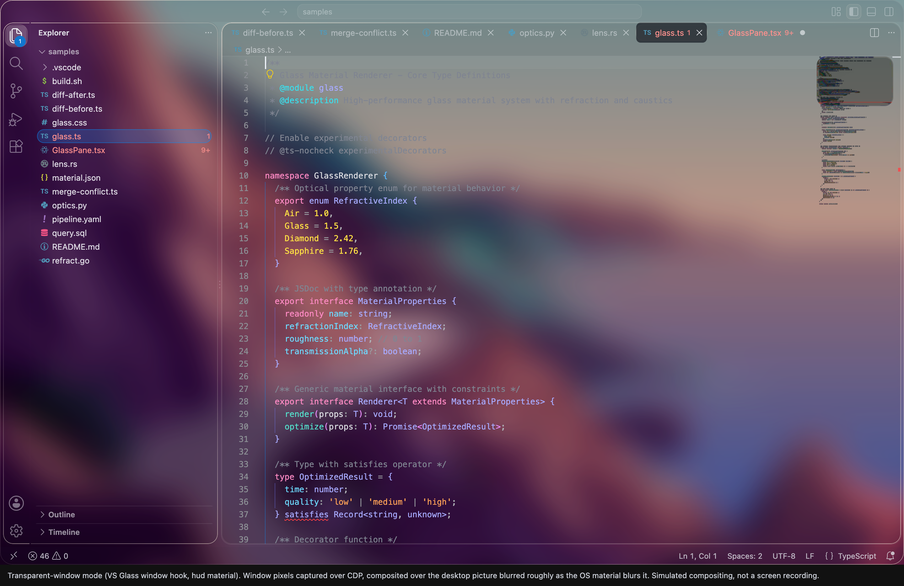
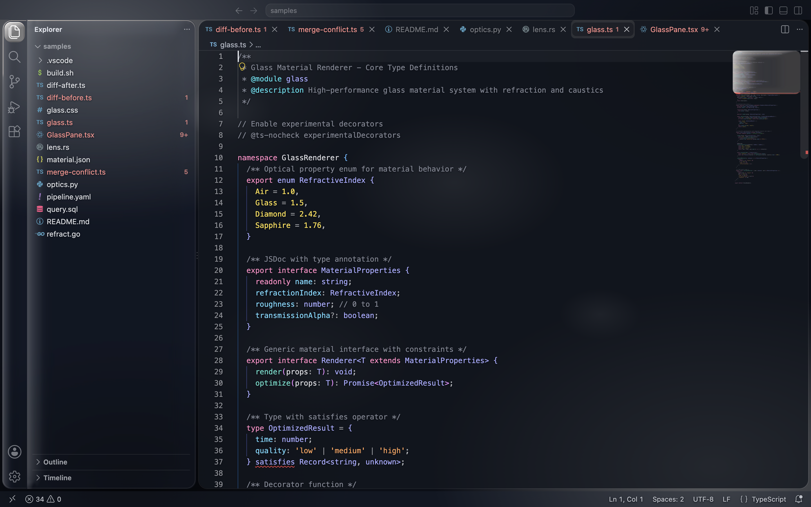
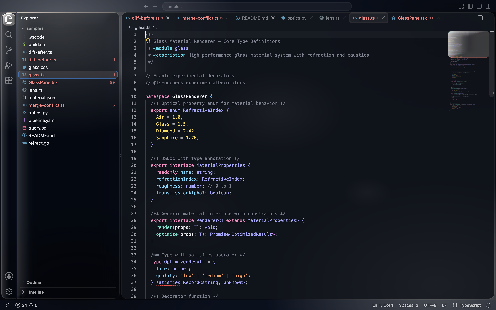
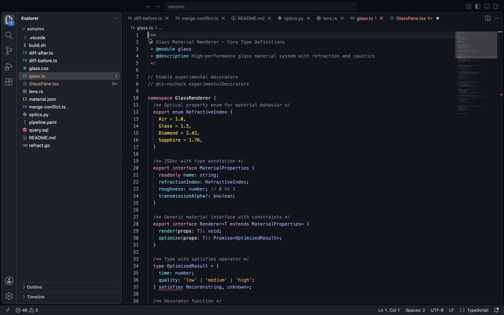
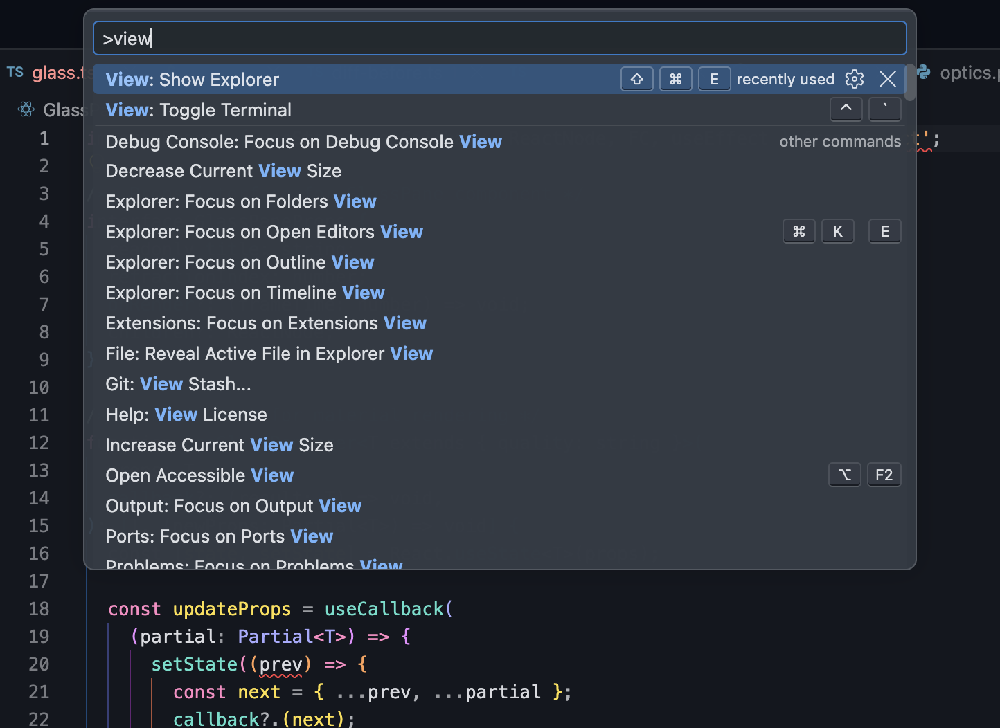
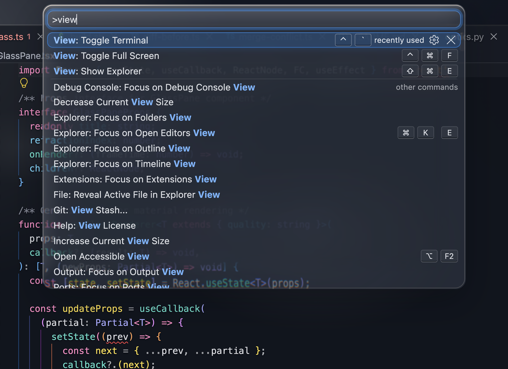

# VS Glass

Glass optics for VS Code: a see-through window, refracting edges, a hairline of specular light and near-clear translucent planes. One extension, no companions, every setting live.

[](https://github.com/MilosHampl/vs-glass/releases/latest)
[](LICENSE)

[](https://github.com/MilosHampl/vs-glass/actions/workflows/ci.yml)

VS Glass is an unofficial, fan-made project. It is not affiliated with, endorsed by, or sponsored by Apple.

VS Glass is colourless clear glass, built for a transparent window first. The Electron window itself is
see-through; the workbench above it is a stack of near-clear planes — editor, side bars, panel, strips —
that paint almost nothing of their own, so what you see behind the code is your desktop through the OS
material. Floating widgets (command palette, menus, hovers, notifications) keep a frosted body so they stay
readable, and their rims genuinely refract the code beneath them: SVG displacement in `backdrop-filter`,
with chromatic aberration, like a curved glass edge. There are no painted gradients, sheens, bevels or
drop shadows under the base planes — a shaded band inside a rim reads as a bevelled window frame, not as glass.

## How it works

VS Code has no extension point for a see-through window or for workbench CSS, so VS Glass adds **one**
marker-delimited hook to VS Code's main-process bootstrap (`out/main.js`, the one bootstrap file VS Code
does not checksum). The hook:

- creates every workbench window transparent (one spread spliced into VS Code's window options, read from the
  state file at creation) and gives it a macOS vibrancy material — the see-through part. Creation-time matters: a
  window made transparent afterwards keeps stale pixels wherever the page paints nothing, which shows up as ghosts
  of closed panels and, under backdrop filters, as runaway neon;
- inserts the glass CSS into each window with Electron's `insertCSS` — VS Code's own stylesheets are never edited;
- watches `<user-data>/vs-glass/glass.css` and `state.json`, which the extension rewrites whenever a VS Glass
  setting changes, and re-applies them live.

So after one quit-and-reopen, Density, Tint, Material, Lens and Aberration change the window as you type in
Settings. `VS Glass: Remove` restores `main.js` byte-exact from its backup and deletes the folder.

### The window itself as glass (macOS 26)

> **Opt-in since 1.2.3.** The slab can only show what is actually behind the window, and it needs the OS blur switched
> off to be seen. Over a plain or smooth wallpaper that trades a guaranteed readable blur for an effect that does not
> appear — which is why `auto` is `under-window` vibrancy and the slab is `vsGlass.windowMaterial: liquid-glass` by
> name. It is at its best with a busy desktop, video or other windows behind a zoomed (not native full-screen) window.

Everything above bends what is *inside* the window: a `backdrop-filter` can only sample its own page, never the
windows or video behind it — the compositor draws those later. On macOS 26 the OS's own Liquid Glass can, so VS Glass
ships a second, tiny piece: `bin/vs-glass-helper` (a 300 KB native process) keeps a real Liquid Glass window —
transparent, click-through, shadowless — directly under every VS Code window, ordered just below it and tracked from
the window list (120 Hz while the window moves, 20 Hz at rest, at once when an app is activated). Its CoreAnimation
backdrop is tuned so the body is a pixel-exact pass-through and only the rim refracts and colour-splits: other
windows, video and the desktop bend under the window's edge the way the workbench bends under the in-window rims.
Nothing is screen-captured; the compositor does it. `Lens` and `Aberration` retune the slab as well.

It is a separate process because VS Code's main process runs with library validation, so no extension can load
native code into it. It exits with VS Code, and whenever Window Material is anything else; `VS Glass: Remove` stops
it. Limits: macOS 26 or newer (elsewhere `auto` resolves to `hud`); the slab follows a fast drag with up to a frame
of lag; fullscreen windows are skipped; the rim's aberration comes in hard-edged bands because the OS thresholds its
masks. The tuning uses CoreAnimation's undocumented filter keys — the same ones AppKit sets — so if a future macOS
drops them the helper exits and the window stays see-through with no material. DESIGN.md §5.2 has the anatomy and
the measurements.

## Settings

Everything is a normal VS Code setting (⌘, then search **VS Glass**). Every change applies live.

| Setting | What it does |
|---|---|
| **Effects** | The glass effects and, on macOS, the see-through window. Off restores plain VS Code (the hook is removed on the next Apply). |
| **Window Transparency** | `auto` (macOS: on), `on`, `off`. |
| **Window Material** | `auto` (default) is the system's `under-window` vibrancy: macOS blurs the desktop behind the window, which is what keeps code readable over any wallpaper. `liquid-glass` (macOS 26 or newer) instead puts a Liquid Glass slab under the window and switches that blur **off** — it only looks like glass where there is real content behind the window to refract; over a plain wallpaper it reads as a clear window. See [The window itself as glass](#the-window-itself-as-glass-macos-26). `none` turns both off; the other values are macOS vibrancy materials. |
| **Window Glass Style** | With Window Material on `liquid-glass` (macOS 26): what the slab is made of. `apple-clear` (default) and `apple-regular` are the OS's own Clear and Regular materials; `frosted` is Regular's face under a much deeper blur, for a slab that stays readable over anything; `clear-plane` is a pixel-exact pass-through where only the rim bends. Over a plain wallpaper they all look alike — there is nothing behind the window for a material to show. |
| **Density** (0 to 200) | How frosted the base planes are (window film, editor, side bar, panel, bars). 0 is absolutely clear: only rims, lensing and text. 100 is the tuned default (about 7 %). 200 is opaque. |
| **Widget Density** (0 to 200) | The body of floating widgets (command palette, hovers, suggestions, notifications, dialogs, modal editors such as Settings). Separate from Density, with a readable floor, so modals stay legible while the base window goes clear. |
| **Tint** | `none` (colourless, default) or a thin coloured film: `graphite`, `blue`, `indigo`, `violet`, `teal`, `mint`, `rose`, `amber`. |
| **Lens** | `soft`, `default`, `strong`, `extreme`: how far the rims bend what is behind them (`extreme` turns every rim into a magnifier; displacement and rim width scale together, so nothing folds). |
| **Aberration** | `off`, `subtle`, `default`, `strong`, `extreme`: red-to-blue fringing at the rims, like a curved glass edge (`extreme` is a prism). |
| **Wallpaper** | `auto` paints a neutral smoke backdrop only when the window is not see-through (an opaque window still gets rims with something to bend). |
| **Auto Apply** | Re-apply on every settings change (default). Off means you run **VS Glass: Apply** yourself. |

Commands: **VS Glass: Apply**, **VS Glass: Remove** (restores VS Code's original file byte-exact and cleans up
everything else VS Glass wrote), **VS Glass: Status**, **VS Glass: Open Settings**.

While the effects are on, VS Glass also keeps theme-scoped `[Glass …]` blocks in `workbench.colorCustomizations`.
Webviews (Claude Code, Markdown preview, extension views) paint their own bodies from theme colours, so those colours
carry the same near-clear alphas as the planes. The blocks affect only the Glass themes and are removed with the effects.

Webviews are separate documents, so the workbench stylesheet cannot reach into them. The window hook therefore adopts a
second sheet, `glass/webview.css`, into every webview frame — as a constructed stylesheet, which a webview's Content
Security Policy does not govern. It styles only surfaces it recognises: today that is the **Claude Code** chat, whose
composer becomes the minimap slider's optic (clear, the conversation warped and colour-split as it passes beneath) over
a film dense enough to type on, and whose messages are the same pill as a selected tab. Lens and Aberration apply to it
too. The sheet is written once the hook in this window is current (quit and reopen after updating).

The same knobs exist as plain CSS files for people who inject CSS by other means: `glass/glass.css` plus the
addons in `glass/tints/`, `glass/density/`, `glass/lens/`, `glass/aberration/` and `glass/glass-wallpaper.css`,
loaded in that order after `glass.css`. The extension composes exactly these files from your settings.

## Screenshots



Transparent-window mode, simulated by compositing a CDP capture of the window's own pixels (transparent
page background) over the maintainer's desktop picture, blurred roughly the way the OS material blurs it
(`scripts/composite-transparent.mjs`) — not a screen recording. See `screenshots/transparent/`.

### Variants

| Glass Regular Dark | Glass Clear | Glass Opaque |
|---|---|---|
|  |  |  |

The three shots above are wallpaper mode (an opaque window) — the "opaque window" counterpart to the
transparent hero above. `Glass Opaque` has no Layer 2 effects, by design — see [Install](#install).
`Glass Regular Light` also ships — the pipeline generates it at no extra cost — but it's kept for
completeness, not tuned for the transparent window, and isn't a headline variant here.

### Layer 1 alone vs. Layer 1 + 2

The command palette floating over code is where the refraction actually reads: a frosted body, a clear
refracted rim, and a chromatic edge where the backdrop bends.

| Layer 1 only | Layer 1 + 2 |
|---|---|
|  |  |

**What you're looking at:**

- Near-clear base planes: the editor at about 7 % and the cards and strips at about 6 %, over a 5 % window
  film. The desktop, through the OS material, is the background of your code. Density scales all of it,
  from absolutely clear to opaque.
- The file overview (minimap) carries a slab of clear, edge-curved glass: the viewport slider refracts the code
  lines beneath it — the one place where glass slides over rendered content — with a bright hairline along its top
  and left and a contact shade under it. Set `"editor.minimap.showSlider": "always"` to keep it on the overview
  instead of only on hover.
- A lensing rim on every inside element — command palette, menus, hovers, suggest, notifications, dialogs,
  modal editors, buttons, activity and status pills. The backdrop is genuinely displaced (SVG
  `feDisplacementMap` in `backdrop-filter`), with red-to-blue fringing at the edge. The refracted rim replaces
  what is behind it rather than adding a second copy, so there's no double image. The base panes (side bars,
  panel, bars) carry no filter over the see-through window: nothing in-page sits behind them to bend, and a
  filter over a see-through region only re-samples stale pixels. In wallpaper mode, where the in-page smoke is a
  real backdrop, their rims refract too.
- Edges are a rim hairline — the liquid-glass border — plus the light the lens computes for itself from the
  curvature it is bending with, so that light sits exactly where the glass is working. No drop shadows anywhere, no
  bevel bands, no sheens. The file overview's slider is the one surface with no border at all: a bare plane of glass.
- Widgets keep a frosted body (about 72 %) so menus and modals stay readable whatever the base density.
- Small controls (activity-bar and status-bar pills, secondary buttons, the active tab, sticky scroll) are
  clear films rather than grey bodies, so they take on the colour of whatever sits behind them.
- Concentric corner radii, one ladder: window 20px > cards 16px > widgets 14px > controls 9px > inner rows
  7px (window = card + VS Code's own 4px floating-card margin).

## Install

VS Glass is one extension and needs nothing else: no Vibrancy Continued, no Custom CSS loader.

1. Download `vs-glass-<version>.vsix` from the [latest release](https://github.com/MilosHampl/vs-glass/releases/latest),
   then in VS Code: **Extensions** view → the `…` menu at the top of it → **Install from VSIX…** → pick the file.

   From a terminal instead:

   ```sh
   # macOS
   "/Applications/Visual Studio Code.app/Contents/Resources/app/bin/code" --install-extension vs-glass-1.2.2.vsix
   # Linux / Windows (or macOS with the shell command installed)
   code --install-extension vs-glass-1.2.2.vsix
   ```

   The absolute path is not paranoia: on macOS `code` often is not on `PATH` at all (VS Code installs it from
   **Shell Command: Install 'code' command in PATH**), and a `code` that is a shell alias or function wrapping
   `open -b com.microsoft.VSCode` silently swallows `--install-extension` — it opens a window and installs nothing.
   Check with `type code`. However you install it, "VS Glass" then appears in the Extensions view.
2. Pick a theme (⌘K ⌘T): **Glass Regular Dark** (the flagship), **Glass Clear** (thinner), or **Glass Opaque**
   (no effects, the Reduce Transparency equivalent). **Glass Regular Light** ships too but is not tuned for the
   see-through window. If you have not picked one yet, VS Glass says so once and offers the theme picker.
3. VS Glass asks once whether to apply the glass effects. Say **Apply**, then quit and reopen VS Code once
   (⌘Q — reloading the window is not enough, the hook runs in the main process).
   From then on every VS Glass setting is live.

**Nothing happened?**

- *No "VS Glass" in the Extensions view* — the install did not run. See the `type code` note above, or use the
  Install from VSIX menu.
- *Installed, but no prompt* — the prompt only appears while one of the four Glass themes is active. Run
  **VS Glass: Status** from the Command Palette; it reports the hook, the CSS and the window slab in one message.
- *Applied, but the window is still opaque* — quit VS Code fully (⌘Q) rather than reloading the window, and check
  that no other window patcher (Vibrancy Continued, Custom CSS and JS Loader) is still patched in: both write to the
  same startup file and fight over the window. VS Glass refuses to patch on top of Vibrancy Continued and says so.
- *"could not write to VS Code's own startup file"* — the app is not writable by your user. The error carries the
  exact `chown` command; run it, then **VS Glass: Apply**.
- *"A JavaScript error occurred in the main process" at startup* — the hook block in `main.js` does not parse (the
  extension now refuses to write one that does not, but an interrupted update could still leave one). From a shell,
  in a checkout of this repository: `node scripts/fix-hook.mjs` rewrites the hook and verifies it parses;
  `node scripts/fix-hook.mjs --restore` puts the untouched `main.js` back. Then quit and reopen VS Code.
- *The Claude Code composer is not glass* — the webview sheet needs the current hook in the main process: quit and
  reopen VS Code once after updating. **VS Glass: Status** reports the running hook version.

What "apply" writes, so there are no surprises:

- the hook block in `out/main.js` inside your VS Code installation (backed up first as `main.js.vs-glass-backup`);
- `<user-data>/vs-glass/glass.css`, `webview.css` and `state.json` (your user-data folder is the parent of `User/`,
  e.g. `~/Library/Application Support/Code/`);
- the `[Glass …]` blocks in `workbench.colorCustomizations` in your user settings.

**VS Glass: Remove** reverses all three. VS Code updates overwrite `main.js`, so the see-through window
disappears after an update until VS Glass re-applies (it notices at startup and asks). Uninstalling the
extension without running Remove first also restores `main.js` and deletes the folder (a `vscode:uninstall`
hook); the `[Glass …]` blocks then stay in your settings, inert without the Glass themes, until you delete
them. VS Glass needs VS Code 1.94 or newer (its startup file must be an ES module) and applies the
see-through window on macOS only; elsewhere the wallpaper addon paints an in-page backdrop.

Without the extension host (a CLI-only setup, or if you prefer not to let an extension write to the app), the
bundled script injects the same CSS into VS Code's workbench stylesheet from a shell. It cannot make the
window see-through, so pair it with the wallpaper addon or another transparency provider:

```sh
bash scripts/inject.sh install --wallpaper
bash scripts/inject.sh install --wallpaper --tint indigo --density 150 --lens strong --aberration subtle
bash scripts/inject.sh status | uninstall
```

Full walkthrough and troubleshooting: [`glass/install.md`](glass/install.md).

**Just want it off right now?** Set **VS Glass: Density** to 0 for a fully clear window, or open DevTools
(Help → Toggle Developer Tools) and run
`document.querySelector('.monaco-workbench').classList.add('vs-glass-off')` for a live, in-session toggle.
Switching to a different theme (including Glass Opaque) is the persistent equivalent.

> **Risks**
> - The hook lives in a file inside your VS Code installation, not a supported extension point. Every
>   window-transparency extension has to do this; it is reversible, but real.
> - After each VS Code update the hook is gone until VS Glass re-applies it (it offers to).
> - Microsoft can change `workbench.experimental.modernUI` (rename, restrict, or remove it) in a future release
>   without notice; the floating-panes optics depend on it and degrade to flush seams without it.

## Recommended companion settings

```json
{
  "workbench.experimental.modernUI": true,
  "window.titleBarStyle": "custom",
  "editor.fontFamily": "'SF Mono', 'JetBrains Mono', Menlo, monospace",
  "editor.fontLigatures": true,
  "editor.cursorSmoothCaretAnimation": "on",
  "editor.smoothScrolling": true,
  "workbench.list.smoothScrolling": true,
  "editor.minimap.renderCharacters": false,
  "editor.minimap.showSlider": "always",
  "editor.bracketPairColorization.enabled": true,
  "editor.guides.bracketPairs": "active"
}
```

`SF Mono` is Apple's system monospace font — it is **not bundled** with VS Glass or VS Code, only
available if you already have it installed (e.g. via Xcode). `JetBrains Mono` is the first cross-platform
fallback. If the integrated terminal ever paints over the see-through material, set
`"terminal.integrated.gpuAcceleration": "off"`.

## How close is this to the real material?

An honest scorecard against Apple's own description of each optic (WWDC25 sessions 219/323/356, HIG
Materials). Layer 1 = the color theme; Layer 2 = the injected CSS.

| # | Optic | Status | Layer | Notes |
|---|---|---|---|---|
| 1 | Lensing / refraction | Reproduced | 2 | SVG `feDisplacementMap` in `backdrop-filter`: frosted body, clear rim, chromatic aberration; `lens`/`aberration` settings retune the strength. Reads wherever glass overlaps in-page content — every widget over code, pills, buttons, card rims over the editor seam — and, in wallpaper mode, the neutral smoke behind every card. Refracting what's actually behind the window (the desktop, another window, a playing video) is impossible from CSS; see the limitations note below. With `liquid-glass` (macOS 26) the window's own rim refracts what is genuinely behind the window — other apps, video, the desktop — through the OS compositor. |
| 2 | Specular edge highlight | Reproduced | 2 | A masked `conic-gradient` hairline from a fixed virtual light, plus the curvature light each lens filter computes from its own displacement map and composites onto the refracted rim. Static: Apple's moves with device motion. |
| 3 | Material thickness | Approximated | 2 | A rim hairline and, above all, the optic: the rim bends and disperses what is behind it. No drop shadows anywhere (1.2.0). Not content-aware the way Apple's is. |
| 4 | Vibrancy | Approximated | 1 + 2 | Four alpha label tiers plus `saturate()` and `mix-blend-mode: plus-lighter` on chrome text. No true per-pixel colour sampling of what's behind each glyph. |
| 5 | Floating layered panes | Reproduced | 1 + 2 | VS Code's modern floating layout; the cards are clear panes with a rim light. Degrades to flush seams without `workbench.experimental.modernUI`. |
| 6 | Concentric geometry | Reproduced | 2 | Radius tokens overridden so inner radius = parent radius − padding. VS Code's own radii still drive most controls outside Layer 2's reach. |
| 7 | Adaptive tint | Approximated | 1 + 2 | Default material is colourless. The OS material's blur of your real desktop supplies the adaptive tint; the optional tint films add a fixed colour instead — no colour mesh either way. |
| 8 | Liquid response | Approximated | 2 | Minimal by the owner's direction: press scale (buttons, icon buttons, pills), widget pop-in, and a focus glow on list rows — no hover motion, no painted highlights. No spring physics, no morphing between shapes. |

Performance: on a 120 Hz display, editor scrolling measures p50 8.3 ms / p95 8.6 ms with every glass surface
active versus p50 8.3 ms / p95 8.5 ms with effects off. The heaviest case, scrolling code beneath an open
command palette, lands at p95 9.2 ms. Method and full numbers in `DESIGN.md` §6.

**What is not possible:** refracting what's actually behind the window — the desktop, another window, a
video playing underneath VS Code — is impossible from CSS, full stop. The renderer never receives those
pixels at all: `backdrop-filter` can only bend what the page itself painted. macOS composites whatever is
behind a window only after the page has already been drawn, and its behind-window materials only blur and
saturate; they don't hand those pixels back to the app to filter. So Layer 2 refracts only in-page content,
and deliberately ships no "desktop mirror" or other fake (a painted copy of the wallpaper standing in for
the real thing), because the owner ruled fakery out. A perfectly clear, unblurred window is out of reach as
well: VS Code creates its windows opaque, and only a vibrancy material makes them see-through afterwards, so
the desktop always arrives blurred and tinted by the material you pick. True content-aware shadows and
device-motion-driven highlights are not reproduced. Editor text is never filtered, by design — legibility
comes first. Context menus are the one overlay Layer 2 cannot reach at all: on macOS, VS Code shows native OS
menus by default, and with `window.menuStyle: "custom"` it renders them inside an isolated shadow root
injected CSS cannot penetrate, so they always show the theme's plain `menu.*` colours, never a glass rim.
Dropdown lists and every other overlay are unaffected.

## Contributing

See [`CONTRIBUTING.md`](CONTRIBUTING.md) — this is a generated theme; almost nothing under `themes/` or
`glass/` should be hand-edited. It covers the build pipeline, the material model, audit gates, the test beds
and the release process. Please also read the [Code of Conduct](CODE_OF_CONDUCT.md).

## License

MIT © 2026 Milos Hampl. See [`LICENSE`](LICENSE).

## Credits

- Apple's [Human Interface Guidelines](https://developer.apple.com/design/human-interface-guidelines) and
  WWDC25 sessions 219 ("Meet Liquid Glass"), 323 ("Build a SwiftUI app with the new design"), and 356
  ("Get to know the new design system") — the design reference this project is built against. This is an
  unofficial, unaffiliated homage; Apple, macOS, and Liquid Glass are trademarks of Apple Inc.
- [shuding/liquid-glass](https://github.com/shuding/liquid-glass) and
  [kube.io's "Liquid Glass in the Browser"](https://kube.io/blog/liquid-glass-css-svg/) — the
  displacement-map-in-`backdrop-filter` lineage this project's lensing technique builds on.
- [ruri.design](https://ruri.design)'s Glass tool — the chromatic-aberration recipe (displaced R/G/B
  channels, recomposited) used in Layer 2's lens filters.
- [Vibrancy Continued](https://github.com/illixion/vscode-vibrancy-continued) and
  [Custom CSS and JS Loader](https://marketplace.visualstudio.com/items?itemName=be5invis.vscode-custom-css) —
  the community extensions that showed the way; VS Glass's hook takes the same route (a patched bootstrap
  file) with a smaller footprint.
- VS Code's own experimental modern UI (`workbench.experimental.modernUI`) — the floating-card layout
  Layer 2's optics are designed for.
